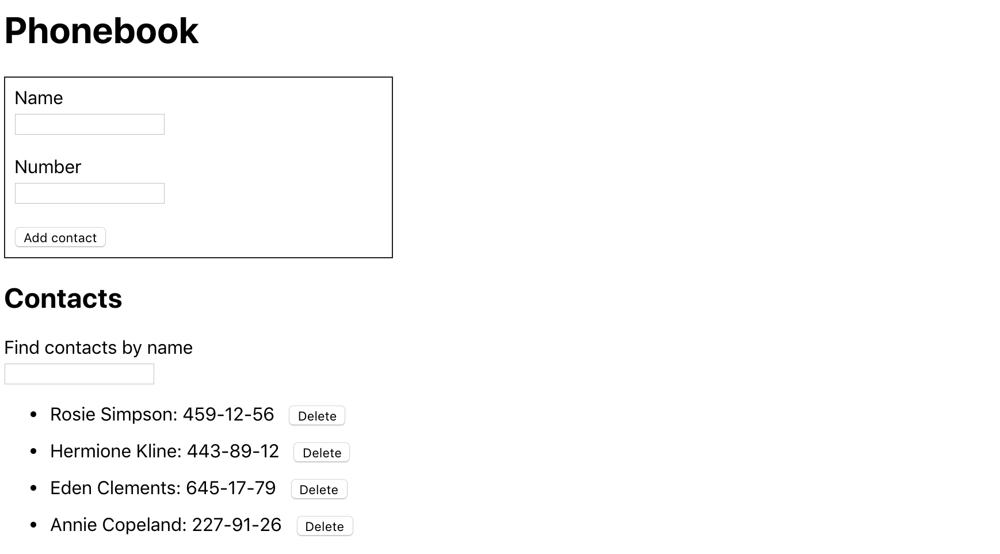
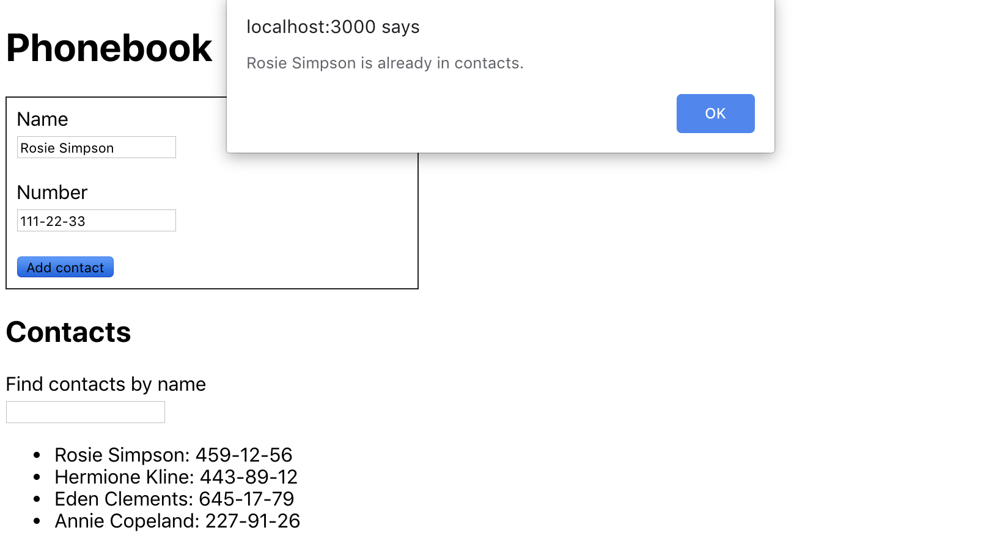

**Читать на других языках: [Українська](./docs/README.ua.md),
[English](./docs/README.en.md).**

## Формы. Жизненный цикл компонента.

_В этом разделе курса я изучу, как работать с формами и получать данные, которые
ввел пользователь. Моя задача - создать приложение для хранения контактов
телефонной книги. Также я научусь работать с методами жизненного цикла react
компонента._

---

<details>
<summary>Превью списка контактов</summary>



</details>

---

#### В приложении для хранения контактов будет реализовано следующее:

1. **Базовая структура и добавление контактов**: Я создам класс компонент
   `<App>`, который будет хранить состояние приложения в виде объекта. Состояние
   будет содержать массив контактов и имя. Также я создам форму для добавления
   контакта. Она будет содержать `input` для ввода имени с валидатором и кнопку
   добавления контакта. Добавлю обработчик для формы, который будет обновлять
   состояние при добавлении нового контакта. Для каждого нового контакта создам
   уникальный `id` с помощью пакета `uuid`. Каждый контакт должен быть объектом
   с `id` и `name`. Я реализую вывод контактов из состояния `contacts` с помощью
   метода `.map()` для создания списка. Начальное состояние будет выглядеть
   следующим образом:

```ts
// App.tsx state
state = {
  contacts: [],
  name: '',
};
```

```ts
// contact object
{
  id: uuid(),
  name: 'User Name',
}
```

<details>
<summary><b><em>Интерфейс может выглядеть так:</em></b></summary>


</details>
<br>

2. **Добавление номеров телефонов**: Я должен расширить состояние, добавив новое
   поле `number`. Для номера добавить `input` с паттерном валидации. Обновить
   обработчик формы так, чтобы он добавлял как `name`, так и `number` к каждому
   новому контакту. Теперь каждый контакт должен отображать как имя, так и номер
   телефона.

```ts
// App.tsx state
state = {
  contacts: [],
  name: '',
  number: '',
};
```

```ts
// contact object
{
  id: uuid(),
  name: 'User Name',
  number: 'User Phone Number',
}
```

<details>
<summary><b><em>Интерфейс может выглядеть так:</em></b></summary>


</details>
<br>

3. **Фильтрация списка контактов**: В состояние я добавлю поле `filter` для
   фильтра контактов. Поле поиска должно быть контролируемым элементом,
   обновляющим значение `filter` в состоянии. Создам метод, который будет
   возвращать отфильтрованный список контактов, учитывая значение `filter`.
   Фильтрация должна быть нечувствительной к регистру. Метод для фильтрации
   контактов нужно использовать перед рендерингом списка, отображая только те,
   что совпадают с `filter`.

```ts
// App.tsx state
state = {
  contacts: [],
  name: '',
  number: '',
  filter: '',
};
```

<details>
<summary><b><em>Интерфейс может выглядеть так:</em></b></summary>


</details>
<br>

4. **Рефакторинг в отдельные компоненты**: Компонент `App` стал очень большим и
   его необходимо разбить на более мелкие компоненты. Я создам следующие
   компоненти:

   - `<AddContactForm>`- для формы добавления контактов.
   - `<ContactsList>` - для отображения списка контактов.
   - `<ContactItem>` - для каждого элемента списка контактов.
   - `<SearchFilter>` - для поля поиска.

   Логику работы с состоянием и методы оставлю в корневом компоненте `<App>`, а
   новые компоненты сделаю «глупыми», получающими данные через `props`. В
   `<App>` оставлю только состояние `contacts` и `filter` для управления всей
   телефонной книгой.
   <!-- ignore-prettier -->
   <br>

5. **Предотвращение дублирования контактов**: Для предотвращения дублирования
   контактов я должен написать проверку, существует ли контакт с таким же именем
   в массиве contacts. Если контакт с таким именем уже существует, я буду
   использовать `react-toastify` и выводить сообщение, чтобы предупредить
   пользователя и не добавлять контакт.

<details>
<summary><b><em>Интерфейс c 'alert' может выглядеть так:</em></b></summary>



</details>
<br>

6. **Удаление контактов**: В компоненте `<ContactItem>` нужно добавить кнопку
   удаления контакта. Затем, в `<App>` я должен создать метод, с помощью
   которого контакт будет удаляться по `id`. Это метод я должен прокинуть
   (prop-drilling) в `<ContactsList>` и дальше в `<ContactItem>`, чтобы вызвать
   его при нажатии на кнопку удаления.

<details>
<summary><b><em>Интерфейс может выглядеть так:</em></b></summary>


</details>
<br>

7. **Сохранение в _localStorage_**: Для сохранения контактов в `localStorage` я
   должен использовать метод жизненного цикла `componentDidUpdate` в `<App>`,
   чтобы обновлять `localStorage` каждый раз, когда меняется состояние
   `contacts`. Чтобы прочитать из `localStorage` при загрузке компонента в
   `componentDidMount` я добавлю логику, которая проверит наличие данных в
   `localStorage`. Если данные есть, установит их в состояние `contacts`.
   <!-- ignore-prettier -->
   <br>

Используя классовые компоненты в проекте "Список контактов", я смог изучить
работу с формами и методами жизненного цикла. Это дало мне возможность лучше
понять, как управлять вводом данных, обрабатывать их для обновления состояния, а
также сохранять данные в localStorage. Такой опыт помог мне глубже понять
взаимодействие компонентов и организацию приложения на React.
