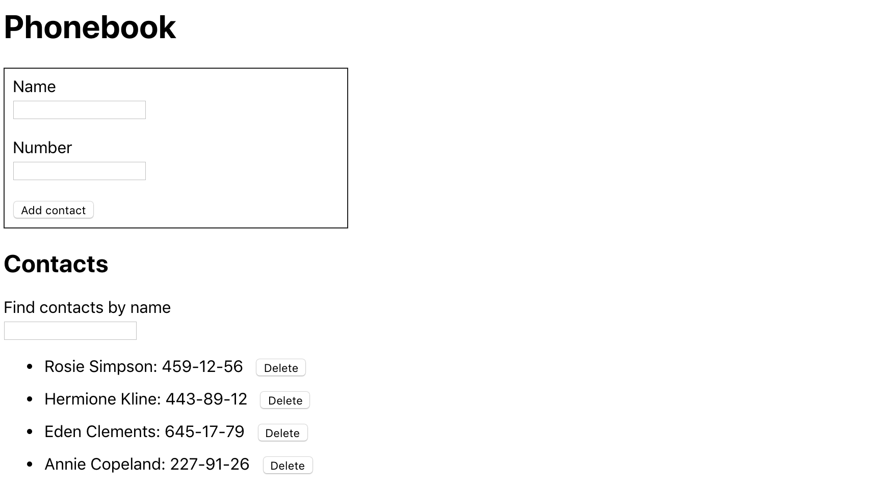
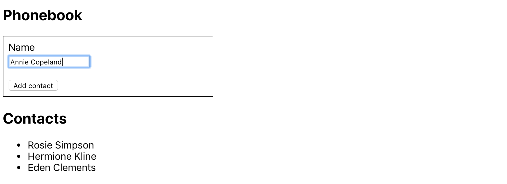

**Read in other languages: [Russian](../README.md),
[Ukrainian](./README.ua.md).**

## Forms. Component Lifecycle.

_In this section of the course, I will learn how to work with forms and obtain
user-entered data. My task is to create an application for storing phonebook
contacts. I will also learn to work with React component lifecycle methods._

---

<details>
<summary>Contact List Preview</summary>



</details>

---

#### The phonebook application will implement the following:

1. **Basic Structure and Adding Contacts**: I will create a class component
   `<App>` to store the application state as an object. The state will contain
   an array of contacts and a name. I will also create a form for adding a
   contact with an `input` for entering the name with a validator, and a button
   to add the contact. I’ll add a form handler that will update the state when
   adding a new contact. Each new contact will have a unique id generated using
   the `uuid` package. Each contact will be an object with `id` and `name`. I
   will render contacts from the `contacts` state using the `.map()` method to
   create a list. The initial state will look like this:

```ts
// App.tsx state
state = {
  contacts: [],
  name: '',
};
```

```ts
// contact object
{
  id: uuid(),
  name: 'User Name',
}
```

<details>
<summary><b><em>The interface might look like this:</em></b></summary>



</details>
<br>

2. **Adding Phone Numbers**: I need to extend the state by adding a new `number`
   field. For the phone number, I’ll add an `input` with a validation pattern.
   I’ll update the form handler to add both `name` and `number` for each new
   contact. Now each contact should display both name and phone number.

```ts
// App.tsx state
state = {
  contacts: [],
  name: '',
  number: '',
};
```

```ts
// contact object
{
	id: uuid(),
	name: 'User Name',
	number: 'User Phone Number',
}
```

<details>
<summary><b><em>The interface might look like this:</em></b></summary>


</details>
<br>

3. **Filtering the Contact List**: I will add a `filter` field to the state to
   filter contacts. The search field will be a controlled element that updates
   the `filter` value in the state. I’ll create a method that returns a filtered
   list of contacts, considering the `filter` value. Filtering should be
   case-insensitive. The method for filtering contacts will be used before
   rendering the list, displaying only those that match the `filter`.

```ts
// App.tsx state
state = {
  contacts: [],
  name: '',
  number: '',
  filter: '',
};
```

<details>
<summary><b><em>The interface might look like this:</em></b></summary>


</details>
<br>

4. **Refactoring into Separate Components**: The `<App>` component has become
   too large and needs to be broken down into smaller components. I will create
   the following components:

   - `<AddContactForm>` - for the contact addition form.
   - `<ContactsList>` - for displaying the list of contacts.
   - `<ContactItem>` - for each item in the contact list.
   - `<SearchFilter>` - for the search field.

   I’ll keep the state logic and methods in the root component `<App>`, and make
   the new components "dumb," receiving data via props. In `<App>`, I’ll keep
   only the contacts and filter state for managing the entire phonebook.
   <!-- ignore-prettier -->
   <br>

5. **Preventing Contact Duplicates**: o prevent duplicate contacts, I need to
   check if a contact with the same name already exists in the contacts array.
   If a contact with the same name exists, I will use `react-toastify` to
   display a message alerting the user and avoid adding the contact.

<details>
<summary><b><em>The interface with 'alert' may look like this:</em></b></summary>


</details>
<br>

6. **Deleting Contacts**: In the `<ContactItem>` component, I will add a delete
   button. Then, in `<App>`, I’ll create a method that deletes a contact by its
   `id`. I’ll pass this method down (prop-drilling) into `<ContactsList>` and
   further into `<ContactItem>` to trigger it by pressing the delete button.

<details>
<summary><b><em>The interface may look like this:</em></b></summary>


</details>
<br>

1. **Saving to _localStorage_**: To save contacts in localStorage, I’ll use the
   `componentDidUpdate` lifecycle method in `<App>` to update localStorage every
   time the contacts state changes. To read from localStorage when the component
   loads, I’ll add logic in `componentDidMount` that checks for data in
   localStorage. If data is available, it will set it in the contacts state.
   <!-- ignore-prettier -->
   <br>

By using class components in the "Contact List" project, I was able to explore
working with forms and lifecycle methods. This gave me a better understanding of
managing data input, processing it to update state, and storing data in
localStorage. This experience helped me gain deeper insight into component
interaction and organizing a React application.
