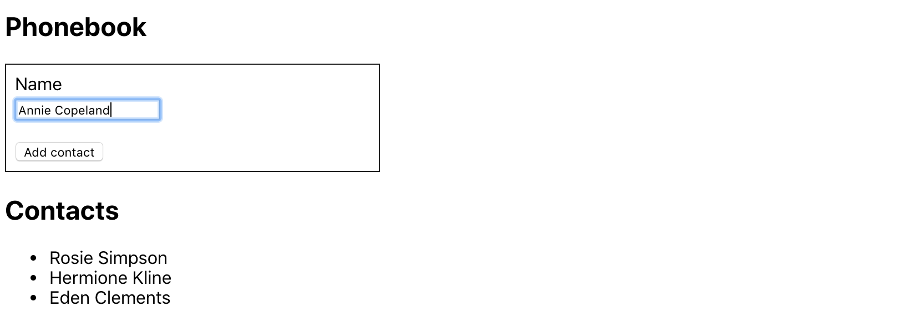

**Читати іншими мовами: [Русский](../README.md), [English](./README.en.md).**

## Форми. Життєвий цикл компонента.

_У цьому розділі курсу я вивчу, як працювати з формами та отримувати дані, які
вводить користувач. Моє завдання – створити застосунок для зберігання контактів
телефонної книги. Також я навчуся працювати з методами життєвого циклу
компонентів у React._

---

<details>
<summary>Попередній перегляд списку контактів</summary>


</details>

---

#### У застосунку для зберігання контактів буде реалізовано наступне:

1. **Базова структура та додавання контактів**: Я створю клас-компонент `<App>`,
   який буде зберігати стан застосунку у вигляді об’єкта. Стан міститиме масив
   контактів і ім'я. Також я створю форму для додавання контакту, яка міститиме
   `input` для введення імені з валідатором і кнопку додавання контакту. Додам
   обробник для форми, який буде оновлювати стан при додаванні нового контакту.
   Для кожного нового контакту створю унікальний `id` за допомогою пакета
   `uuid`. Кожен контакт має бути об'єктом із полями `id` та `name`. Я реалізую
   виведення контактів із стану `contacts` за допомогою методу `.map()` для
   створення списку. Початковий стан буде виглядати так:

```ts
// App.tsx state
state = {
  contacts: [],
  name: '',
};
```

```ts
// contact object
{
	id: uuid(),
	name: 'User Name',
}
```

<details>
<summary><b><em>Інтерфейс може виглядати так:</em></b></summary>



</details>
<br>

2. **Додавання номерів телефонів:**: Я маю розширити стан, додавши нове поле
   `number`. Для номера додам `input` з шаблоном для валідації. Оновлю обробник
   форми, щоб він додавав як `name`, так і `number` до кожного нового контакту.
   Тепер кожен контакт має відображати як ім'я, так і номер телефону.

```ts
// App.tsx state
state = {
  contacts: [],
  name: '',
  number: '',
};
```

```ts
// contact object
{
	id: uuid(),
	name: 'User Name',
	number: 'User Phone Number',
}
```

<details>
<summary><b><em>Інтерфейс може виглядати так:</em></b></summary>


</details>
<br>

3. **Фільтрація списку контактів**: У стан я додам поле `filter` для фільтрації
   контактів. Поле пошуку має бути контрольованим елементом, який оновлює
   значення `filter` у стані. Я створю метод, який буде повертати
   відфільтрований список контактів, враховуючи значення `filter`. Фільтрація
   має бути нечутливою до регістру. Метод для фільтрації контактів потрібно
   використовувати перед рендерингом списку, відображаючи лише ті, що
   відповідають `filter`.

```ts
// App.tsx state
state = {
  contacts: [],
  name: '',
  number: '',
  filter: '',
};
```

<details>
<summary><b><em>Інтерфейс може виглядати так:</em></b></summary>


</details>
<br>

4. **Рефакторинг у окремі компоненти**: Компонент `<App>` став занадто великим і
   його необхідно розділити на дрібніші компоненти. Я створю наступні
   компоненти:

   - `<AddContactForm>`- для форми додавання контактів.
   - `<ContactsList>` - для відображення списку контактів.
   - `<ContactItem>` - для кожного елемента списку контактів.
   - `<SearchFilter>` - для поля пошуку.

   Логіку роботи з станом та методи залишу в кореневому компоненті `<App>`, а
   нові компоненти зроблю «простими», передаючи дані через props. У `<App>`
   залишу тільки стан `contacts` і `filter` для управління всією телефонною
   книгою.
    <!-- ignore-prettier -->
    <br>

5. **Запобігання дублюванню контактів**: Щоб запобігти дублюванню контактів, я
   маю написати перевірку, чи існує контакт із таким же ім'ям у масиві
   `contacts`. Якщо контакт із таким ім'ям вже існує, я використаю
   `react-toastify`, щоб вивести повідомлення, яке попереджає користувача та не
   додає контакт.

<details>
<summary><b><em>Інтерфейс з 'alert' може виглядати так:</em></b></summary>


</details>
<br>

6. **Видалення контактів**: У компоненті `<ContactItem>` потрібно додати кнопку
   для видалення контакту. Далі, у `<App>` я створю метод, за допомогою якого
   контакт буде видалятися за `id`. Цей метод я маю передати (prop-drilling) у
   `<ContactsList>` і далі в `<ContactItem>`, щоб викликати його при натисканні
   на кнопку видалення.

<details>
<summary><b><em>Інтерфейс може виглядати так:</em></b></summary>


</details>
<br>

7. **Збереження у _localStorage_**: Для збереження контактів у localStorage я
   маю використовувати метод життєвого циклу `componentDidUpdate` у `<App>`, щоб
   оновлювати localStorage кожного разу, коли змінюється стан `contacts`. Щоб
   прочитати з localStorage при завантаженні компонента, у `componentDidMount` я
   додам логіку, яка перевірить наявність даних у localStorage. Якщо дані є,
   встановить їх у стан `contacts`.
   <!-- ignore-prettier -->
   <br>

Використовуючи класові компоненти в проєкті "Список контактів", я зміг вивчити
роботу з формами та методами життєвого циклу. Це дало мені можливість краще
зрозуміти, як керувати введенням даних, обробляти їх для оновлення стану, а
також зберігати дані в localStorage. Такий досвід допоміг мені глибше зрозуміти
взаємодію компонентів і організацію застосунку на React.
